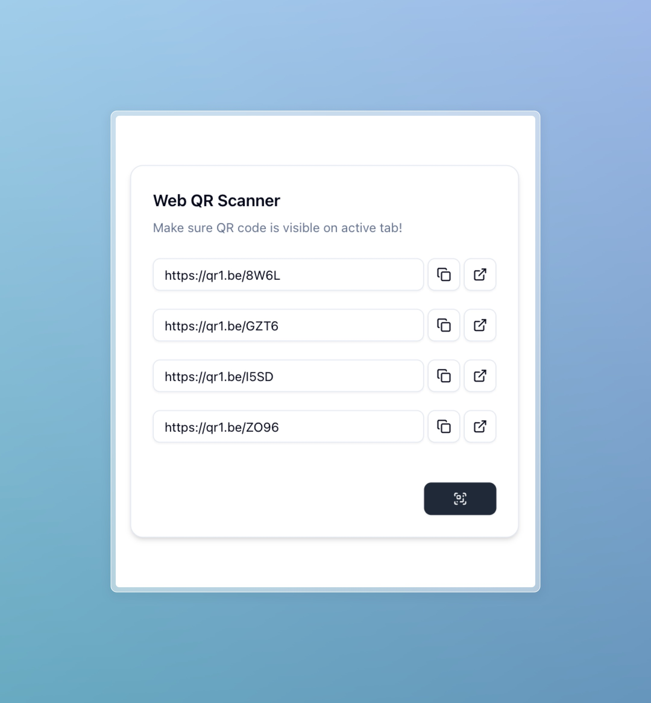

# Web QR Scanner



A simple chrome extension that allows users to scan visble QR Codes directly from web pages.

### Features:
* Scan and extract multiple QR Codes in a single capture.
* One-click buttons to copy URLs or open them in new tabs.
* Simple and minimal UI built with `shadcn/ui`.

### Built With
*  
* 
* 
* 
* [**zxing-wasm**](https://github.com/Sec-ant/zxing-wasm)

## Getting Started

> [!NOTE]
> If you have previously cloned this repository, please run `git pull` to make sure you have the latest updates.

### Prerequisites

Make sure you have the following installed:

* 

### Installation

1. Clone the repository:
   ```sh
   git clone https://github.com/EzekielSuresh/Web-QR-Scanner
   cd Web-QR-Scanner
   ```

2. Install dependencies:
   ```sh
   npm install
   ```

3. Build the project:
   ```sh
   npm run build
   ```

4. Load the extension in Chrome:
   - Open `chrome://extensions/`
   - Enable **Developer Mode** 
   - Click **Load unpacked**
   - Select the `dist/` folder 

## Usage

### Permissions Used

- `tabs`: Required to capture the visible tab.

## Roadmap

- [X] Add 'copy all' and 'open all' button for captured URLs
- [X] Add support for multiple QR Code scanning
- [X] Add copy button for scanned QR Code URL


